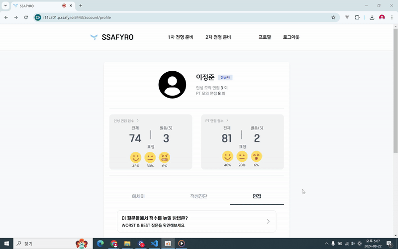

# SSAFYRO - SSAFY로 가기 위한 이정표

삼성 청년 소프트웨어 아카테미 (SSAFY) 입과 준비를 위한 사이트입니다.
각 전형 별 가이드 제공 및 면접 스터디를 제공하고, 피드백을 통해 부족한 부분을 보완하는 기능을 제공합니다.

# 기획 배경

- SSAFY 시험, 잘 모르겠어!
- 시험 문제는? 방식은? 난이도는?
- 면접의 형태와 주제는?
- 지방인데 면접 스터디는?

SSAFY 입과에 필요한 정보들을 얻기 위해 오픈 카카오톡방을 찾아 들어가도, 대외비로 인해 많은 정보를 찾기 힘든 문제가 있었습니다. 그래서 입과를 준비하는 사람들을 위해 제공할 수 있는 정보 및 면접준비를 할 수 있도록 프로젝트를 기획하게 되었습니다.

# 프로젝트 주요 기능

## 에세이(자기소개서) 첨삭
Chat-gpt를 사용하여 에세이 첨삭이 가능합니다.   

## 면접 서비스
인성 면접과 PT 면접을 제공합니다.
- 면접은 차례를 바꿔가며 면접관, 면접자 역할을 수행합니다.
- PT 면접 주제는 최신 IT용어와 관련된 내용을 제공합니다.   

#### 면접 준비 시스템   
    OpenVidu(WebRTC)를 사용하여 웹 환경에서 최대 3명까지의 면접 스터디원을 모집하여 서로 피드백을 주고 받을 수 있는 면접 준비가 가능합니다.

#### 면접 순서 자동화   
    면접 순서를 사용자가 정하지 않습니다.   
    주어진 시간동안 질의응답을 하고, 면접자는 답변 제출 버튼을, 면접관은 각 답변과 전체 면접에 대한 채점만 하면 됩니다.   
    필요한 질문과 면접자 역할의 순환은 시스템이 자동으로 지정해주며, 동기화됩니다.

## 답변 데이터 분석
1. AI 표정 인식 모델을 사용한 답변자의 표정 분석
2. 발음 평가 기술 API를 사용한 답변자의 발음 분석
3. Web Speech API의 STT 기능을 이용한 텍스트 변환
4. 변환된 텍스트를 Chat-gpt를 사용하여 피드백 제공.  

## 높은 점수를 받은 다른 사용자의 답변 제공
자신이 받았던 질문 중 유사한 질문을 받은 다른 사용자의 답변을 제공합니다.   
다른 사용자의 답변은 높은 점수를 받은 답변을 위주로 제공합니다.   

# 기술 스택

---

### Frontend

- React
- React Router
- Tailwind CSS
- STOMP.js
- Axios
- face-api.js (표정 분석 모델)
- Web Speech API (Sound-to-Text)

### Backend

- SpringBoot
- Spring Data Jpa
- Spring Ai
- Spring Rest Docs
- Redis
- RabbitMQ
- MySQL
- ElasticSearch
- Stomp Web Socket

### Infra

- AWS ec2
- NginX
- Docker
- Jenkins

### Project Management, Version Control

- git
- gitLab
- JIRA

# 제작 기간

---

2024.07.02. - 2024.08.16.

# 팀원 소개

---

최민규

- 팀장 및 PM
- Frontend 개발
- CI 로고 디자인, Promotion Video(UCC) 기획 및 제작
- 프레젠테이션 디자인 및 최종 발표 담당

이정준

- Frontend 개발
- WebSocket(STOMP.js) 담당
- UCC 출연

고도연

- Frontend 파트장
- UI 디자인 검수

김두열

- Backend 파트장
- CI/CD 및 인프라
- UCC 출연, 중간 발표 담당

유재광

- Fullstack 개발

박지훈

- Backend 개발
- 프레젠테이션 디자인 참여
